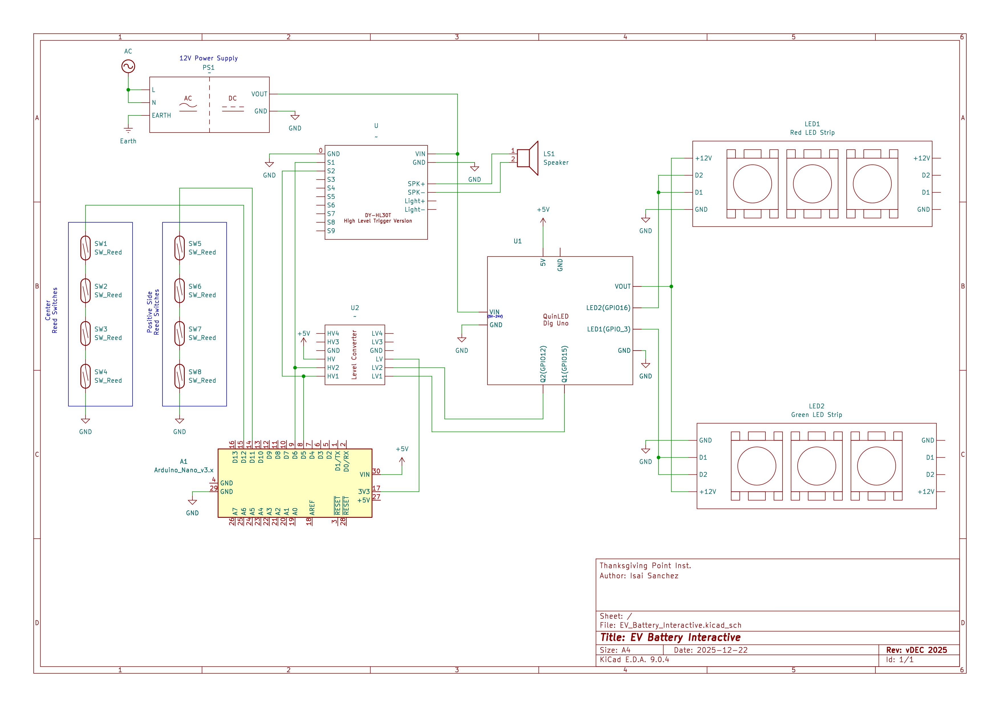

# EV Battery Interactive

https://github.com/user-attachments/assets/273c9546-eabc-42aa-9840-0eb63d9e132e

## Overview

The source code for the EV Battery Pack interactive, located at Kidopolis in Thanksgiving Point's Museum of Natural Curiosity. This interactive is designed to teach children about the importance of polarity in a real life and modern application, an electric vehicle battery pack!

When the batteries are inserted in the correct orientation, a green LED strip plays an animation showing the battery pack powering different components of the vehicle, along with a "success" sound effect. Any incorrect orientation will play a glowing red LED strip animation, along with an "incorrect" sound effect.

To accomplish this, reed switches were used to detect the battery's orientation, which has embedded magnets that close the switches. An Arduino Nano is able to detect the state of the reed switches, apply some debouncing and state machine logic, and send the appropriate signals to the LED driver and sound module.

## Hardware List

- Microcontroller: Arduino Nano
- 8 x Reed switches (2 per battery cavity)
- LED Drivers: 1 x [QuinLED Dig Uno](https://quinled.info/quinled-dig-uno/)
- LED Strips: 2 x 12V WS2815 LED strips
- Sound module: 1 x DY-HL30T active high triggered version
- Power supply: MEAN WELL RS-75-24 Power Supply AC-DC

## Wiring Diagram

## Software Architecture

### Arduino Nano Sketch

Sends HIGH level signals to QuinLED and DY-HL30T based on which reed switches are open or closed. Debouncing and state machine logic is applied to ensure a smooth/stable user experience, because reed switches close really fast.

### QuinLED Dig Uno Sketch

Receives high signals from nano and plays corresponding animations. Incorrect placement of batteries causes a glowing red "incorrect" effect, while a correct placement causes a smooth green animation representing current flow through the car.
